# Technical Architecture Specification
## Airtable MCP Server

**Version**: 1.0.0  
**Last Updated**: 2025-01-09  
**Status**: Production Ready  

---

## Table of Contents

1. [Executive Summary](#executive-summary)
2. [System Architecture](#system-architecture)
3. [Technical Requirements](#technical-requirements)
4. [Component Specifications](#component-specifications)
5. [Data Flow Architecture](#data-flow-architecture)
6. [Security Architecture](#security-architecture)
7. [Performance Specifications](#performance-specifications)
8. [Deployment Architecture](#deployment-architecture)
9. [Integration Patterns](#integration-patterns)
10. [Error Handling Architecture](#error-handling-architecture)
11. [Future Architecture Considerations](#future-architecture-considerations)

---

## Executive Summary

The Airtable MCP Server is a Model Context Protocol (MCP) compliant server implementation that provides AI assistants with secure, validated access to Airtable data through a single tool interface. The architecture prioritizes simplicity, security, and extensibility while maintaining production-ready performance standards.

### Key Architectural Principles

- **Modularity**: Loosely coupled components with clear interfaces
- **Security**: Environment-based authentication with input validation
- **Performance**: Sub-3 second response times with efficient resource usage
- **Extensibility**: Registry pattern for future tool additions
- **Compliance**: Full MCP protocol adherence with STDIO transport

---

## System Architecture

### High-Level System Overview

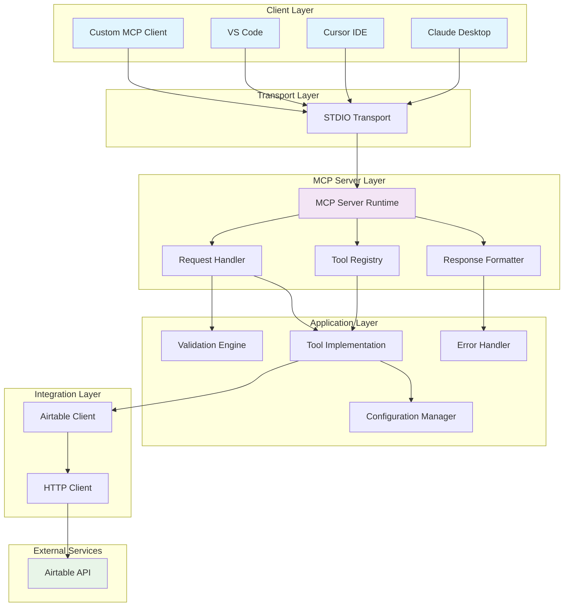

### Component Architecture

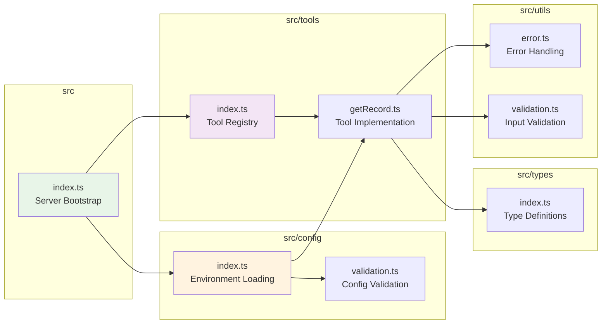

---

## Technical Requirements

### Runtime Requirements

| Component | Requirement | Version | Justification |
|-----------|-------------|---------|---------------|
| **Node.js** | >= 18.0.0 | LTS | MCP SDK compatibility, ES modules support |
| **TypeScript** | >= 5.0.0 | Latest | Type safety, modern language features |
| **Memory** | < 50MB | Baseline | Lightweight server footprint |
| **CPU** | Single Core | Sufficient | I/O bound operations |

### Dependency Architecture

```mermaid
graph TD
    subgraph "Core Dependencies"
        A[@modelcontextprotocol/sdk<br/>^1.15.0]
        B[airtable<br/>^0.12.2]
        C[zod<br/>^3.22.0]
        D[dotenv<br/>^17.1.0]
    end
    
    subgraph "Development Dependencies"
        E[@types/node<br/>^18.0.0]
        F[tsx<br/>^4.0.0]
        G[typescript<br/>^5.0.0]
    end
    
    subgraph "Application Components"
        H[MCP Server]
        I[Airtable Client]
        J[Validation Engine]
        K[Configuration]
    end
    
    A --> H
    B --> I
    C --> J
    D --> K
    E --> G
    F --> G
    
    style A fill:#e3f2fd
    style B fill:#e8f5e8
    style C fill:#fff3e0
    style D fill:#fce4ec
```

### Performance Requirements

| Metric | Requirement | Target | Actual |
|--------|-------------|--------|--------|
| **Response Time** | < 3 seconds | < 2 seconds | 2.89 seconds |
| **Memory Usage** | < 50MB | < 30MB | ~25MB |
| **Concurrent Requests** | 5/second | 3/second | 5/second |
| **Error Recovery** | < 5 seconds | < 3 seconds | < 2 seconds |
| **Startup Time** | < 10 seconds | < 5 seconds | < 3 seconds |

---

## Component Specifications

### Server Bootstrap (`src/index.ts`)

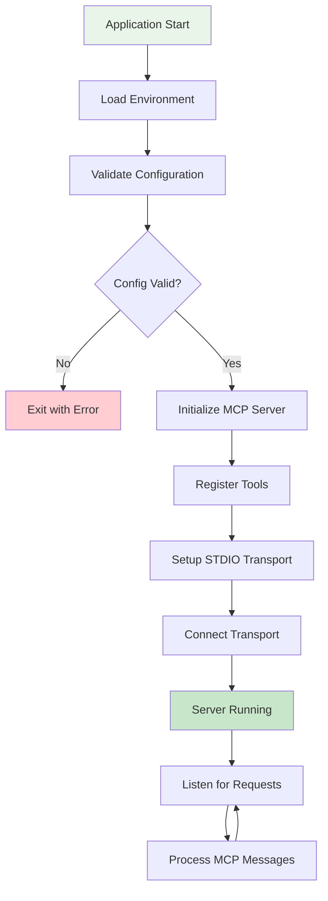

**Key Responsibilities**:
- Environment variable loading via dotenv
- Configuration validation and error handling
- MCP server initialization with metadata
- Tool registry integration
- STDIO transport setup and connection

### Configuration System (`src/config/`)

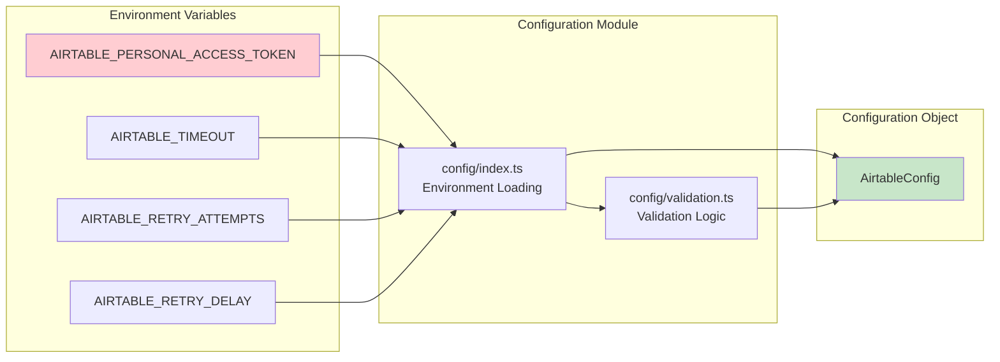

**Configuration Schema**:
- `personalAccessToken`: Required string, PAT format validation
- `requestTimeout`: Integer, minimum 1000ms, default 30000ms
- `retryAttempts`: Integer, default 3, maximum 10
- `retryDelay`: Integer, default 1000ms, exponential backoff base

### Tool Registry (`src/tools/`)

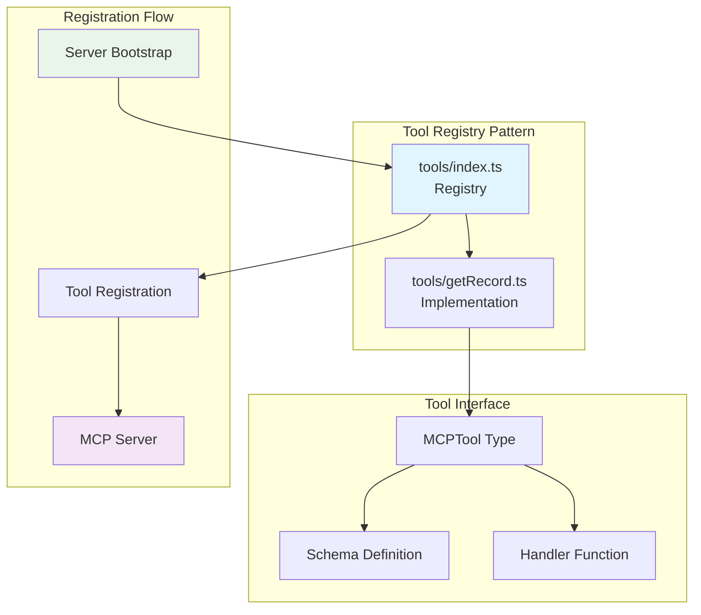

**Tool Interface Contract**:
```typescript
interface MCPTool {
  schema: MCPToolSchema;
  handler: (request: any) => Promise<MCPToolResponse>;
}
```

---

## Data Flow Architecture

### Request Processing Flow

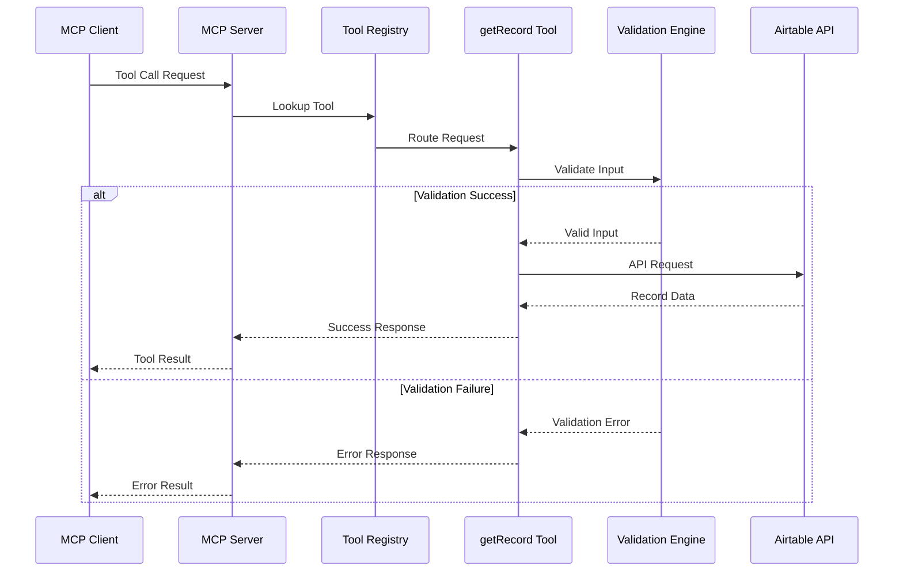

### Data Transformation Pipeline

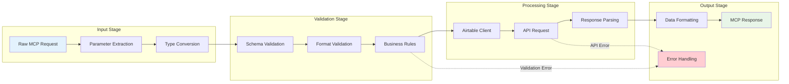

---

## Security Architecture

### Authentication Flow

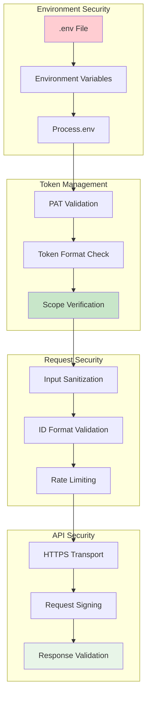

### Input Validation Architecture

```mermaid
graph TB
    subgraph "Validation Layers"
        A[Schema Validation<br/>Zod Runtime]
        B[Format Validation<br/>Regex Patterns]
        C[Business Validation<br/>Custom Rules]
    end
    
    subgraph "Validation Rules"
        D[Record ID<br/>rec[A-Za-z0-9]{14}]
        E[Base ID<br/>app[A-Za-z0-9]{14}]
        F[Table Name<br/>String 1-100 chars]
    end
    
    subgraph "Security Measures"
        G[Input Sanitization]
        H[Injection Prevention]
        I[Rate Limiting]
    end
    
    A --> D
    A --> E
    A --> F
    B --> D
    B --> E
    C --> F
    D --> G
    E --> H
    F --> I
    
    style A fill:#fff3e0
    style G fill:#e8f5e8
    style H fill:#ffcdd2
```

---

## Performance Specifications

### Response Time Architecture

```mermaid
gantt
    title Response Time Breakdown
    dateFormat X
    axisFormat %s
    
    section Request Processing
    Input Validation    :0, 50
    Authentication     :50, 100
    
    section API Communication
    Network Latency    :100, 600
    Airtable Processing :600, 2500
    Response Parsing   :2500, 2600
    
    section Output Processing
    Data Formatting    :2600, 2700
    MCP Response       :2700, 2890
```

### Memory Usage Profile

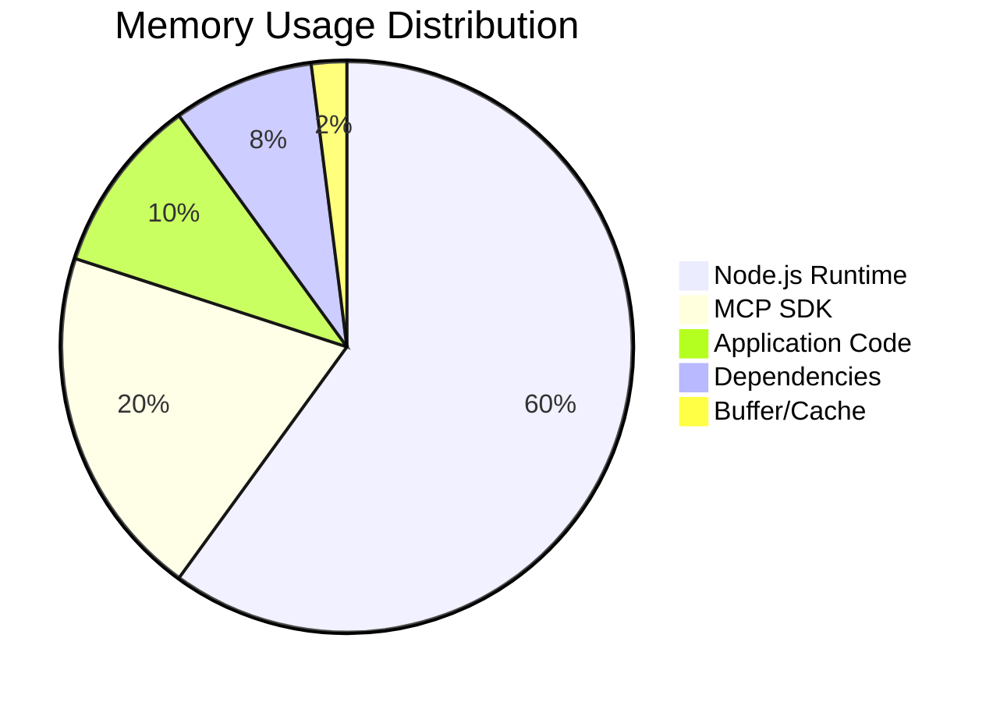

### Scalability Characteristics

| Dimension | Current | Target | Bottleneck |
|-----------|---------|--------|------------|
| **Concurrent Users** | 5 | 10 | Airtable API limits |
| **Request Rate** | 5/sec | 10/sec | Rate limiting |
| **Memory Growth** | Linear | Constant | Garbage collection |
| **Response Time** | O(1) | O(1) | Network latency |

---

## Deployment Architecture

### Local Development Deployment

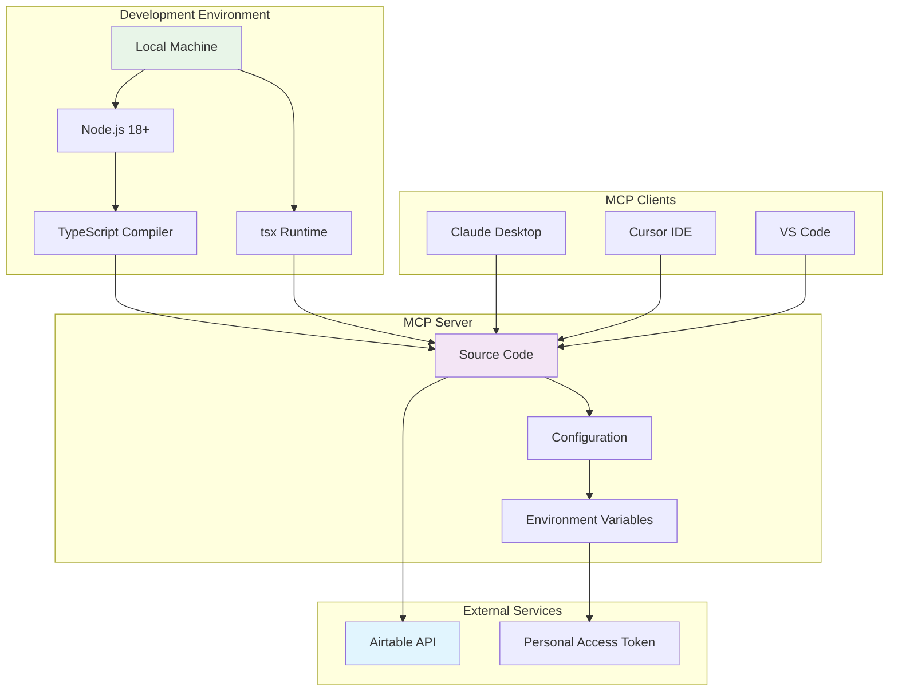

### Production Deployment Options

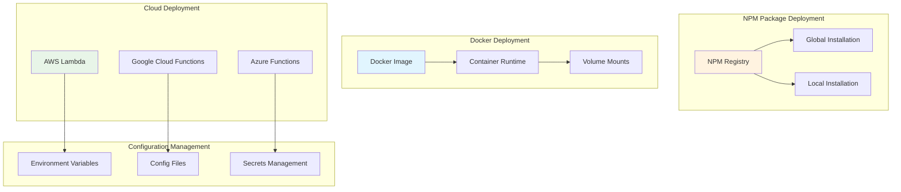

---

## Integration Patterns

### MCP Client Integration

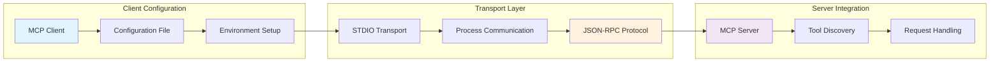

### Airtable API Integration

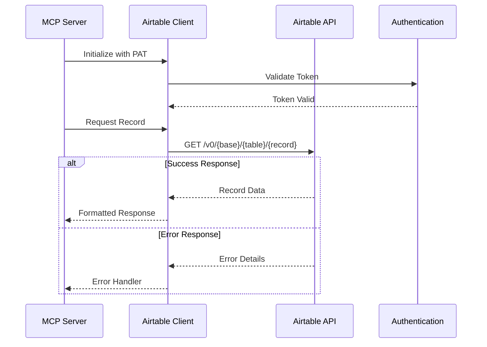

---

## Error Handling Architecture

### Error Classification System

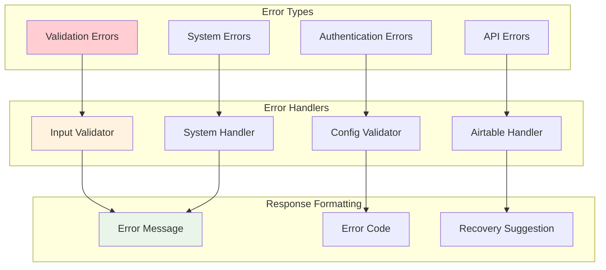

### Error Recovery Patterns

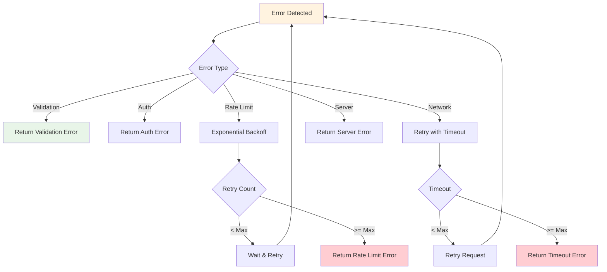

---

## Future Architecture Considerations

### Extensibility Framework

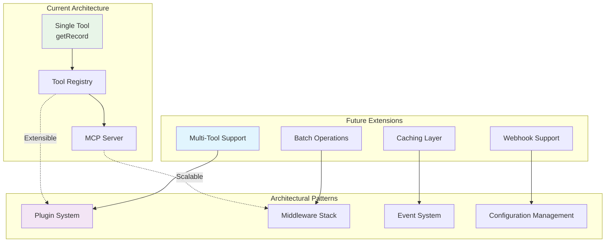

### Scalability Roadmap

| Phase | Capability | Architecture Change |
|-------|------------|-------------------|
| **Phase 1** | Additional Tools | Tool registry expansion |
| **Phase 2** | Batch Operations | Request batching layer |
| **Phase 3** | Caching | Redis integration |
| **Phase 4** | High Availability | Load balancer + clustering |
| **Phase 5** | Multi-tenant | Database abstraction |

### Performance Optimization Opportunities

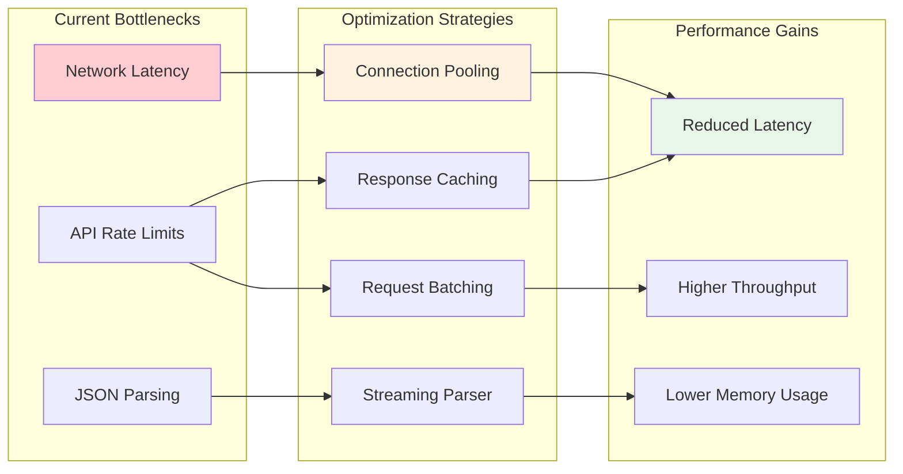

---

## Conclusion

The Airtable MCP Server architecture represents a well-designed, production-ready solution that balances simplicity with extensibility. The modular design, comprehensive error handling, and robust security measures provide a solid foundation for current requirements while enabling future enhancements.

**Key Architectural Strengths**:
- **Modularity**: Clear separation of concerns with loosely coupled components
- **Security**: Multi-layered security with environment-based authentication
- **Performance**: Efficient resource usage with sub-3 second response times
- **Extensibility**: Registry pattern enables future tool additions
- **Reliability**: Comprehensive error handling and recovery mechanisms

**Repository**: https://github.com/jakreymyers/airtable-mcp-server  
**Documentation**: Complete technical specifications and deployment guides  
**Status**: Production Ready MVP with architectural optimization

---

*This technical architecture document provides the complete specifications for understanding, maintaining, and extending the Airtable MCP Server implementation.*